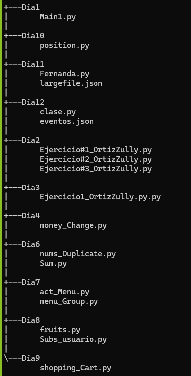

## PYTHON 

En este repositorio esta regritrados los dias de trabajo en la plataforma de python donde se registra mi proceso de aprendizaje de este programa.

## Descripción

Consta de 12 carpetas cada una tiene una funcionalidad diferente:

1. **Dia1**: 
* Contiene toda la información de como trabajar en python desde como print hola mundo hasta sus funciones
* Contiene el nivel basico de como hacer que el ususario escriba en la consola, como utilizar los booleanos y como utilizar las condiciones
* En ek condigo contiene una breve documentación del uso de cada linea para asi no perderse y asi hacer que cualquier persona observe el codigo tenga un conocimiento y no se pierda.

2. **Dia2**:
 - Contiene tres carpetas: `Ejercicio#1_OrtizZully.py`, `Ejercicio#2_OrtizZully.py` y `Ejercicio#1_OrtizZully.py` Cada uno tiene una ejecución diferente:
 
  - `Ejercicio#1_OrtizZully.py`: Elaboracion de Fibonacci donde tendra una breve al usuario de como es el uso del fibonacci donde tendra que ingresar los numeros que desea generar, al generar los resultados en la consola le mostrara dos opciones una si quiere repetir el programa o si salir del programa, el codigo es muy simple y facil de entender. 

  - `Ejercicio#2_OrtizZully.py`: elaboración de  un juego interactivo en el que el usuario debe adivinar un número secreto elegido aleatoriamente por el programa. El número secreto está en el rango de 1 a 100. Después de cada intento del usuario, el programa proporciona pistas indicando si el número secreto es mayor o menor que la suposición actual. El objetivo es adivinar el número secreto en la menor cantidad de intentos posible, el numero de intentos sera infinito, en el codigo contiene una documentacion de como fue la elaboración del codigo.

  - `Ejercicio#3_OrtizZully.py`: Elaboración de un juego interactivo en el que el usuario debe adivinar un número secreto elegido aleatoriamente por el programa. El número secreto está en el rango de 1 a 100.Después de cada intento del usuario, el programa proporciona pistas indicando si el número secreto es mayor o menor que la suposición actual. El objetivo es adivinar el número secreto en la menor cantidad de intentos posible, solo tendra 10 intentos, el codigo tiene documentacion de como realice el codigo.

3. **Dia3**:
- Contiene una carpeta llamada `Ejercicio#2_OrtizZully.py.py` donde contiene menu principal con varias opciones: 
   
    1. Numeros primos: El usuario a digitar esta opción tendra que ingresar el numero que desee saber si es primo o no donde tiene un codigo con condicionales para poder darle la respuesta.
    2. informacion adicional de primos: En la consola mostrara una breve definicion en que consiste los números primos.
    3. Contraseñas aleatorias: El usuario digitara la cantidad de letras que va a tener la contraseña don ayuda de la bibliote *import secrets* y *import string* se generara una contraseña aleatoria.
    4. informacion adicional de contraseñas: En la consola mostrara una breve definicion y la importacia de tener contraseñas seguras.
    0. Salir: Finalizara el programa.

4. **Dia4**:
- Contiene una carpeta llamada *money_Change.py* donde su funcion es la siguiente: 

* Un menu principal con tres opciones:
    1. Saber el cambio del billete.
    - El usuario tendra que ingresar el billete que le desee realizar el cambio 
    2. Información adicional.
    - En la consola le va aparecer al usuario una breve descripcion de como se va a realizar el cambio.
    - Los cambios se daran solo con las monedas 10, 5 y 1 si el usuario ingresa una cantidad de 27 se desglosara de esta forma
        - 2 monedas de 10
        - 1 modeda de 5
        - 2 monedas de 1
        - el total sera 27 
    0. Salir del programa:
    - El programa finalizará. 

5. **Dia6**: Contiene dos carpetas llamadas `nums_Duplicate.py` y `Sum.py`:

    1. `nums_Duplicate.py`:
        - El usuario tendra que ingresar una lista de numeros donde la funcion sera mostrales en la consola de una forma ordena y sin que ningun numero se repita.
        - Si el usuario ingresa una cantidad mayor de 300 no podra seguir por que ha llegado al limite de cantidad de numeros que podra ingresar.

    2. `Sum.py`: 
        - El usuario tendra que ingresar un numero donde el programa buscara en una lista de numeros dos numeros sumados de la cantidad digita y le mostrara en la posicion que se encuentra.

6. **Dia7**: Contiene dos carpetas llamadas `act_Menu.py` y `menu_Group.py`:

    1. `act_Menu.py`:
        - Al usuario se le mostrara un menu principal donde se le mostrara 4 opciones:
            1. Agrega skincare al carrito
            2. Ver contenido del carrito
            3. Total de la compra
            4. Finalizar compra
        - Cada opcion tiene una funcion diferente, donde podra agregar, ver, y onservar la cantidad de productos que tiene la tiendo 

    2. `menu_Group.py`: 
        - Es la misma funcion que el anterios solo que el trabajo fue realizado en grupo. 

7. **Dia8**:  Contiene dos carpetas llamadas `fruits.py` y `Subs_usuario.py`:
  
    1. `fruits.py`:
        - Creacion de diccionarios con listas dond tendra cada una una función:
         1. Convertir los nombres de las frutas en mayusculas donde utiliza .upper
         2. Mostrar la fruta que tenga el precio menor a 0.50.
         3. Mostrar el numero mayor de las frutas disponibles.
         4. ordenAR decreciente, el valor de la fruta en stock se calculara multiplicando el número de frutas

    2. `Subs_usuario.py`: 
        -  Tendra una menu principal donde tendra cada una tiene una función.
            1. Iniciar sesion: Para poder iniciar sesion tendra que crear cuenta.
            2. Crear cuenta: Creacion de usuarios y contraseñas.
            3. Añadir dinero a la cuenta: Para poder comprar una suscripción tendra que tener dinero en la cuenta. 
            4. Comprar suscripcion: Al tener dinero en la cuenta podra comprar las suscripciones que deseen.
            5. Regalar una suscripcion a un amigo: Tendran el cupo de regalo para un amigo.
            0. Finalizar: Finalicion del programa.

8. **Dia9**: Contiene una carpeta llamadad `shopping_Cart.py` donde su funcion es la siguiente:
    1. Añadir productos al carrito.
    2. Mostrar las comprar que tiene.
    3. Cerrar compra

    - Para poder elaborar este condigo hice uso de las funciones y de algunas funciones basicas para poder realizar la ejecución.

9. **Dia10**: Contiene una carpeta llamada `position.py`
    - Su funcion es agregar numeros a la lista dejandolo de una forma ordena 

10. **Dia11**: Contiene una carpeta llamada `Fernanda.py`
    - Tema de json donde contiene crear, Actualizar, Eliminar y revisar

11. **Dia12**: Contiene una carperta llamada `clase.py`
    - Contiene un json donde debemos que sacar la informacion impotamnte desde la carpeta de json.

## Estrutura

## Lenguajes usados 

- Python 

## Indicaciones 

- Instalar Visual Studio Code
- Descargar Python 
- En Visual instalar la extension python

## Creditos

Elaborado por Zully Fernanda Ortiz Avendaño Cc. 1092528097